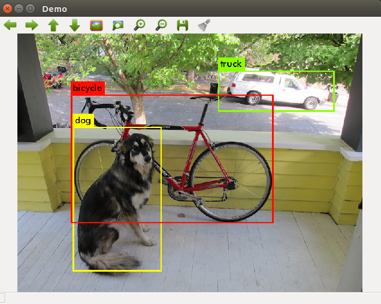

# YOLO ROS: Real-Time Object Detection for ROS

## Overview

We are going to use YOLO object detector in this tutorial with ROS. 

Its  ROS package developed for object detection in camera images. You only look once (YOLO) is a state-of-the-art, real-time object detection system. In the following ROS package you are able to use YOLO (V3) on GPU and CPU. The pre-trained model of the convolutional neural network is able to detect pre-trained classes including the data set from VOC and COCO, or you can also create a network with your own detection objects. For more information about YOLO, Darknet, available training data and training YOLO see the following link: [YOLO: Real-Time Object Detection](http://pjreddie.com/darknet/yolo/).

The YOLO packages have been tested under ROS Melodic and Ubuntu 18.04 and ROS Kinetic Ubuntu 16.04. T





Based on the [Pascal VOC](https://pjreddie.com/projects/pascal-voc-dataset-mirror/) 2012 dataset, YOLO can detect the 20 Pascal object classes:

- person
- bird, cat, cow, dog, horse, sheep
- aeroplane, bicycle, boat, bus, car, motorbike, train
- bottle, chair, dining table, potted plant, sofa, tv/monitor

Based on the [COCO](http://cocodataset.org/#home) dataset, YOLO can detect the 80 COCO object classes:

- person
- bicycle, car, motorbike, aeroplane, bus, train, truck, boat
- traffic light, fire hydrant, stop sign, parking meter, bench
- cat, dog, horse, sheep, cow, elephant, bear, zebra, giraffe
- backpack, umbrella, handbag, tie, suitcase, frisbee, skis, snowboard, sports ball, kite, baseball bat, baseball glove, skateboard, surfboard, tennis racket
- bottle, wine glass, cup, fork, knife, spoon, bowl
- banana, apple, sandwich, orange, broccoli, carrot, hot dog, pizza, donut, cake
- chair, sofa, pottedplant, bed, diningtable, toilet, tvmonitor, laptop, mouse, remote, keyboard, cell phone, microwave, oven, toaster, sink, refrigerator, book, clock, vase, scissors, teddy bear, hair drier, toothbrush

## Citing

The YOLO methods used in this software are described in the paper: [You Only Look Once: Unified, Real-Time Object Detection](https://arxiv.org/abs/1506.02640).

If you are using YOLO V3 for ROS, please add the following citation to your publication:

M. Bjelonic
**"YOLO ROS: Real-Time Object Detection for ROS"**,
URL: https://github.com/leggedrobotics/darknet_ros, 2018.

    @misc{bjelonicYolo2018,
      author = {Marko Bjelonic},
      title = {{YOLO ROS}: Real-Time Object Detection for {ROS}},
      howpublished = {\url{https://github.com/leggedrobotics/darknet_ros}},
      year = {2016--2018},
    }

## Installation

### Dependencies

This software is built on the Robotic Operating System ([ROS]), which needs to be [installed](http://wiki.ros.org) first. Additionally, YOLO for ROS depends on following software. Your ROS version should have already have these dependencies already installed

- [OpenCV](http://opencv.org/) (computer vision library),
- [boost](http://www.boost.org/) (c++ library),

### Building


In order to install darknet_ros, clone this forked version of the original ROS package, (see [how to set up an SSH key](https://confluence.atlassian.com/bitbucket/set-up-an-ssh-key-728138079.html) if you need to setup SSH keys) from this repository into your catkin workspace and compile the package using ROS. It already has pre-trained Yolo network weights so you can use them straight away.  

```bash
    cd catkin_workspace/src
    git clone --recursive https://github.com/lasithaya/darknet_ros.git
    cd ../
```
To maximize performance, make sure to build in *Release* mode. You can specify the build type by setting

    catkin_make -DCMAKE_BUILD_TYPE=Release

or using the [Catkin Command Line Tools](http://catkin-tools.readthedocs.io/en/latest/index.html#)

    catkin build darknet_ros -DCMAKE_BUILD_TYPE=Release

Darknet on the CPU is fast (approximately 1.5 seconds on an Intel Core i7-6700HQ CPU @ 2.60GHz × 8) but it's like 500 times faster on GPU! You'll have to have an Nvidia GPU and you'll have to install CUDA. The CMakeLists.txt file automatically detects if you have CUDA installed or not. CUDA is a parallel computing platform and application programming interface (API) model created by Nvidia. If you do not have CUDA on your System the build process will switch to the CPU version of YOLO. If you are compiling with CUDA, you might receive the following build error:

    nvcc fatal : Unsupported gpu architecture 'compute_61'.

This means that you need to check the compute capability (version) of your GPU. You can find a list of supported GPUs in CUDA here: [CUDA - WIKIPEDIA](https://en.wikipedia.org/wiki/CUDA#Supported_GPUs). Simply find the compute capability of your GPU and add it into darknet_ros/CMakeLists.txt. Simply add a similar line like

    -O3 -gencode arch=compute_62,code=sm_62


### How to use different pre-trained networks for object detection

You need to download the pre-trained weights and the config files for different machine learning modules and place them inside the `catkin_workspace/src/darknet_ros/darknet_ros/yolo_network_config/` folder. 
There are many pre-trained weights from different data sets at [here](https://pjreddie.com/darknet/yolo/).
In order to use these diffrent networtks you need to provide your weights and your cfg file inside the directories:
```bash
    catkin_workspace/src/darknet_ros/darknet_ros/yolo_network_config/weights/
    catkin_workspace/src/darknet_ros/darknet_ros/yolo_network_config/cfg/
```
You can use the following `wget` command to download weights and cfg files

```bash
cd catkin_workspace/src/darknet_ros/darknet_ros/yolo_network_config/weights/
    wget http://pjreddie.com/media/files/yolov2.weights
    wget http://pjreddie.com/media/files/yolov2-tiny.weights
```
In addition, you need to create your config file(yaml)for ROS where you define the names of the detection objects. You need to include it inside:
```
    catkin_workspace/src/darknet_ros/darknet_ros/config/
```
This config file defines the location of the model weights and the config file as well as the object label. Open any ``yaml` available on this folder and see how they have configured. Each object detector model should have its own config file.

Then in the launch file you have to point to your new config file in the line:

```bash
    <rosparam command="load" ns="darknet_ros" file="$(find darknet_ros)/config/your_config_file.yaml"/>
```
Open diffrent launch files in the 'launch' folder and see how they have been configured 


## Basic Usage

In order to get YOLO ROS: Real-Time Object Detection for ROS to run with your robot, you will need to adapt a few parameters. It is the easiest if duplicate and adapt all the parameter files that you need to change from the `darknet_ros` package. These are specifically the parameter files in `config` and the launch file from the `launch` folder.

By default `darknet_ros` package  subscribe to the `camera/rgb/image_raw` topic for object detection. You can change this to your camera image topic in the launch file  to do realtime object detection. In this tutorial we will be using diffrent images from the `~/catkin_ws/src/danet_ros/images/` folder to test diffrent object detector modulers. We will be using the `my_image_publisher` packahe to publish a image as ros image in `/image` topic. Open two terminal and run `roscore`  in a one and run the image publisher mode as follows to publish an image.


```bash
rosrun my_image_publisher image_publisher.py ~/catkin_ws/src/darknet_ros/images/people.jpg

```
### YOLO2-tiny Object Detector

The default object detection classifier in this package is `YOLO2-tiny`. Its a mini version of YOLO2 network and design to run on CPU. You can run it by launching following base launch file. Full list of objects it can detect can be found in `/darknet_ros/config/yolov2-tiny.yaml'

```bash
roslaunch darknet_ros darknet_ros.launch
```
I have alreday changed the image subscriber to `/image`. You will see a window with classification results

### YOLO3-tiny Object Detector
Yolo3 is an improved version of Yolo2. You can launch it by following commad.

```bash
roslaunch darknet_ros  yolo_v3_tiny.launch
```
### Duckietown  Object Detector
I have trained YOLO3 object detect to detects objects from Duckietown. Currently it can detect Duckiebots, Ducks and  Traffic signs. Publish the 'duck.jpg' from the '/image' folder first. You can chnage the `treshold` parameter in    `darknet_ros/darknet_ros/config/yolov3-tiny-duckie.yaml` file if you are not detecting some objects. But lowering that would result in many false postives.

```bash
roslaunch darknet_ros  yolo_v3_tiny_duckie.launch
```


## Nodes

### Node: darknet_ros

This is the main YOLO ROS: Real-Time Object Detection for ROS node. It uses the camera measurements to detect pre-learned objects in the frames.

### ROS related parameters

You can change the names and other parameters of the publishers, subscribers and actions inside `darknet_ros/config/ros.yaml`.

#### Subscribed Topics

* **`/camera_reading`** ([sensor_msgs/Image])

    The camera measurements.

#### Published Topics

* **`object_detector`** ([std_msgs::Int8])

    Publishes the number of detected objects.

* **`bounding_boxes`** ([darknet_ros_msgs::BoundingBoxes])

    Publishes an array of bounding boxes that gives information of the position and size of the bounding box in pixel coordinates.

* **`detection_image`** ([sensor_msgs::Image])

    Publishes an image of the detection image including the bounding boxes.

#### Actions

* **`camera_reading`** ([sensor_msgs::Image])

    Sends an action with an image and the result is an array of bounding boxes.

### Detection related parameters

You can change the parameters that are related to the detection by adding a new config file that looks similar to `darknet_ros/config/yolo.yaml`.

* **`image_view/enable_opencv`** (bool)

    Enable or disable the open cv view of the detection image including the bounding boxes.

* **`image_view/wait_key_delay`** (int)

    Wait key delay in ms of the open cv window.

* **`yolo_model/config_file/name`** (string)

    Name of the cfg file of the network that is used for detection. The code searches for this name inside `darknet_ros/yolo_network_config/cfg/`.

* **`yolo_model/weight_file/name`** (string)

    Name of the weights file of the network that is used for detection. The code searches for this name inside `darknet_ros/yolo_network_config/weights/`.

* **`yolo_model/threshold/value`** (float)

    Threshold of the detection algorithm. It is defined between 0 and 1.

* **`yolo_model/detection_classes/names`** (array of strings)

    Detection names of the network used by the cfg and weights file inside `darknet_ros/yolo_network_config/`.
